# Spring Tool Suite 4の設定

:::caution Spring Tool Suite 4を動かすJavaランタイムの変更

社内環境などでクライアント証明書を設定する必要がある場合は、以下の手順でJavaランタイムを変更してください。

アプリを右クリックして「パッケージ内容を表示」ボタンを押す

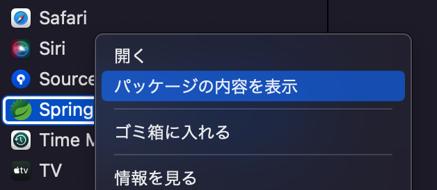

`Contents > Eclipse > SpringTooleSuite4.ini` を開く


`-vm` の次の行を、クライアント証明書を設定したJavaランタイムのパスに変更する。

```text
-startup
../Eclipse/plugins/org.eclipse.equinox.launcher_1.6.500.v20230717-2134.jar
--launcher.library
../Eclipse/plugins/org.eclipse.equinox.launcher.cocoa.macosx.x86_64_1.2.700.v20221108-1024
-product
org.springframework.boot.ide.branding.sts4
--launcher.defaultAction
openFile
-vm
/usr/local/Cellar/openjdk/21/libexec/openjdk.jdk/Contents/Home
-vmargs
--add-opens=java.base/java.io=ALL-UNNAMED
--add-opens=java.base/sun.nio.ch=ALL-UNNAMED
--add-opens=java.base/java.net=ALL-UNNAMED
--add-opens=java.base/sun.security.ssl=ALL-UNNAMED
-Dosgi.requiredJavaVersion=17
-Dosgi.dataAreaRequiresExplicitInit=true
-Dsun.java.command=SpringToolSuite4
-Xms256m
-Xmx2048m
--illegal-access=permit
--add-modules=ALL-SYSTEM
-XstartOnFirstThread
-Dorg.eclipse.swt.internal.carbon.smallFonts
-Xdock:icon=../Resources/sts4.icns
```

:::

## Spring Tool Suite4の起動

TODOアプリのテンプレート作成

```bash
mvn archetype:generate -B\
 -DarchetypeGroupId=org.terasoluna.gfw.blank\
 -DarchetypeArtifactId=terasoluna-gfw-web-blank-archetype\
 -DarchetypeVersion=5.8.1.RELEASE\
 -DgroupId=com.example.todo\
 -DartifactId=todo\
 -Dversion=1.0.0-SNAPSHOT
```

Spring Tool Suite4を起動


## Eclipse Enterprise Java and Web Developer Toolsのインストール

`Help > EclipseMarketplace` を選択して、Eclipse Enterprise Java and Web Developer Toolsプラグインを検索してインストールする。

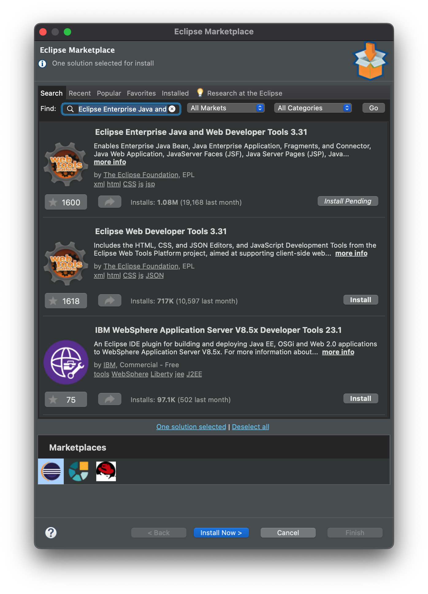

## Spring Tools 3 Add-On for Spring Tools 4のインストール

Spring Tools 3 Add-On for Spring Tools 4プラグインをインストールする前に、 `Mylyn Features` をインストールする。

1. STSのメニューから、Help > Install New Softwareを選択し、Work withに「`https://download.eclipse.org/mylyn/releases/latest`」を入力する。
2. Mylyn Featuresを選択し、インストールを行う。

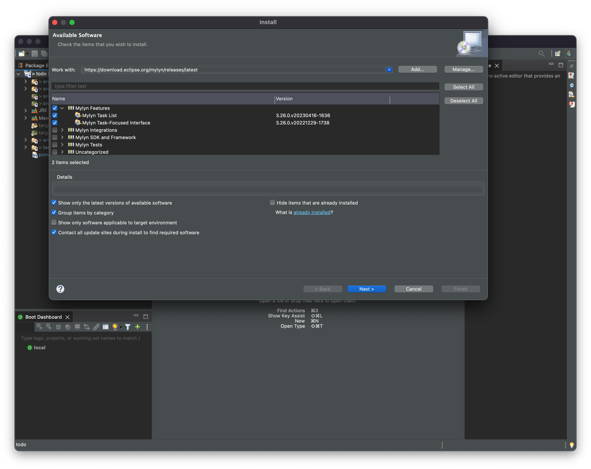

`Mylyn Features` のインストールが完了したら、 `Spring Tools 3 Add-On for Spring Tools 4`プラグインをインストールする。


インストール中に確認が出るので、`Update my installation to be compatible with the items being installed` にチェックを入れて互換性を持たせた状態でインストールする。

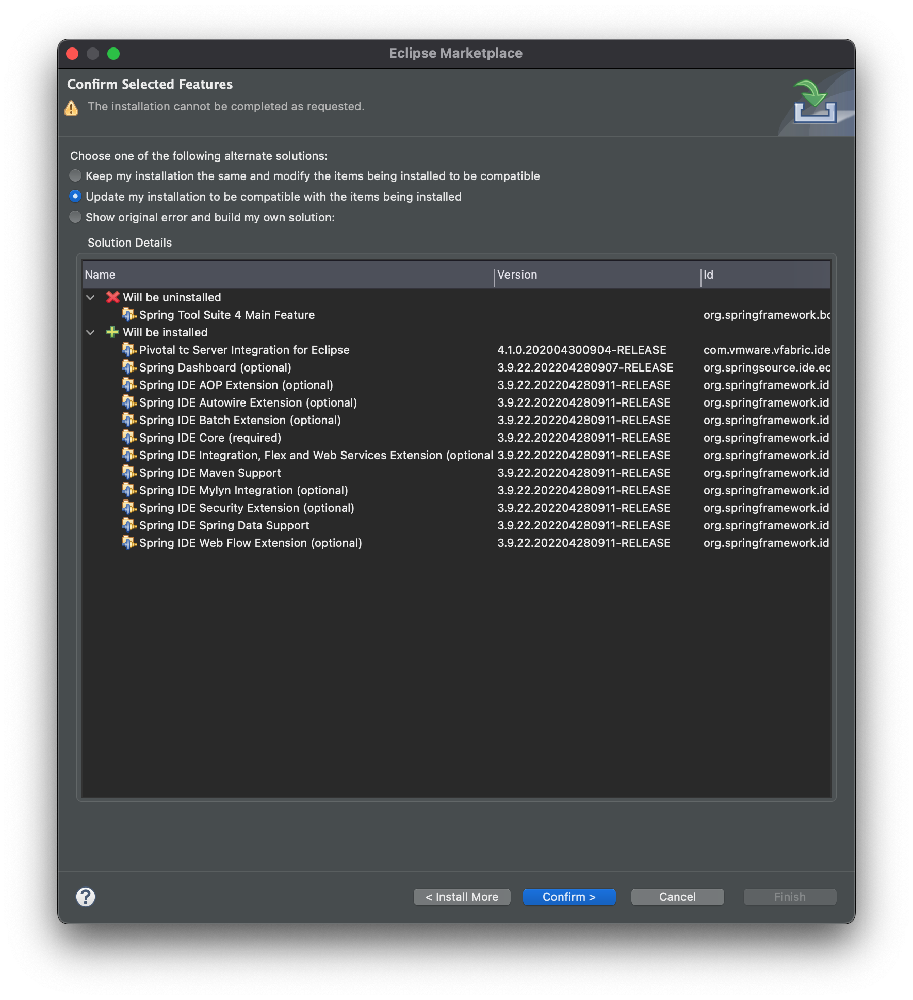

## Java設定

STSの設定によっては予め用意したJDKではなくSTSに同梱されているJDKなどが使用される場合があるので、以下の手順でJDKの設定を確認する。

1. STSのメニューから、`SpringToolSuite4 > Settings...> Java > Installed JREs` を開き、予め用意したJDKにチェックがついていることを確認する。
2. 用意したJDKが一覧に存在しない場合は AddからStandard VMを選択し、Directoryから用意したJDKを選択し追加する。

   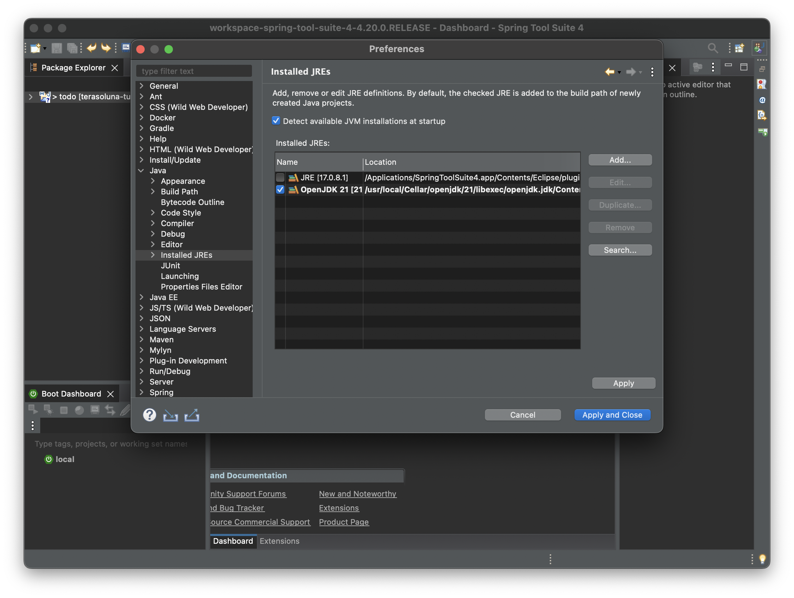

## Maven設定

`SpringToolSuite4 > Settings... > Maven > Installations` から `Add...`を選択し、 `Directory...`からインストールしたMavenを選択し追加する。

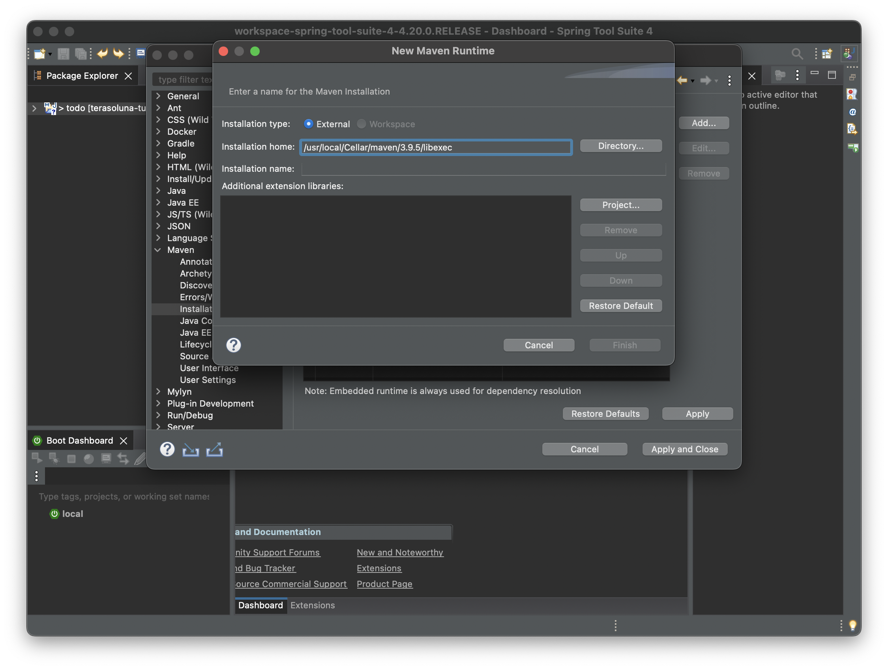

追加したMavenを選択する。

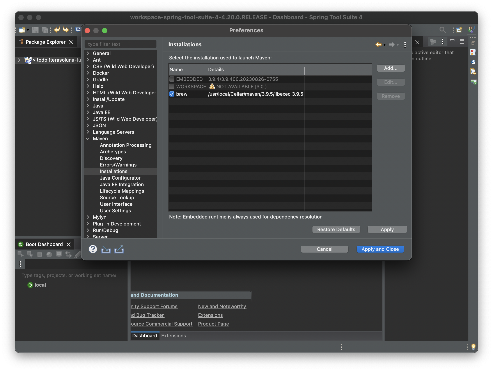

## Server設定

Tomcatを使用する場合の設定手順について説明する。

Serverビューを表示する

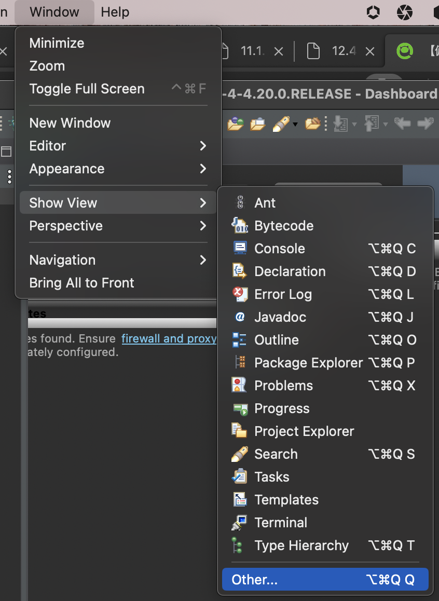


サーバービューの中の `No servers are available. Click this link to create a new server...` をクリック

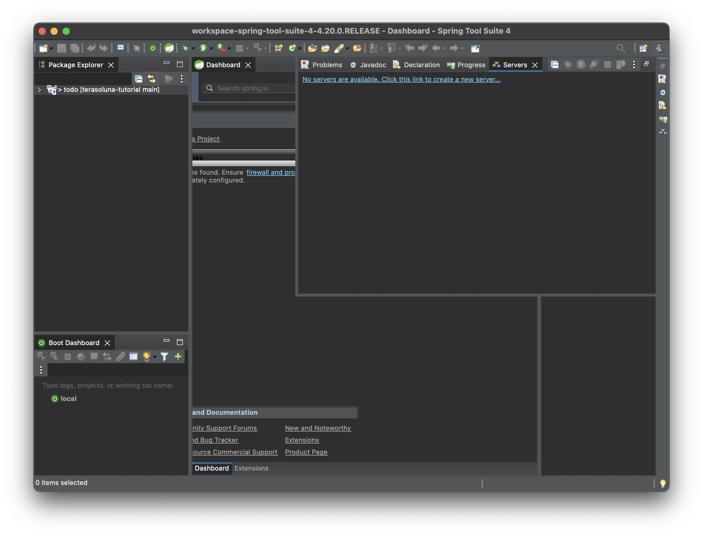

homebrewでインストールしたTomcatのバージョンを選択する。

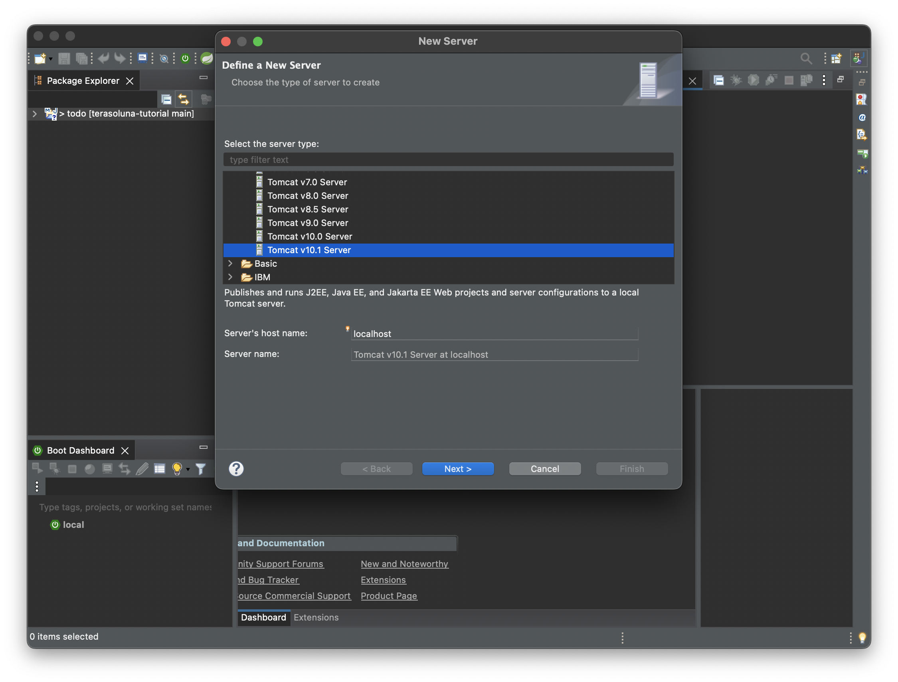

`Tomcat Installation directory:`にインストールしたTomcatのパスを設定する。

`JRE:`にインストールしたJavaのパスを設定する。

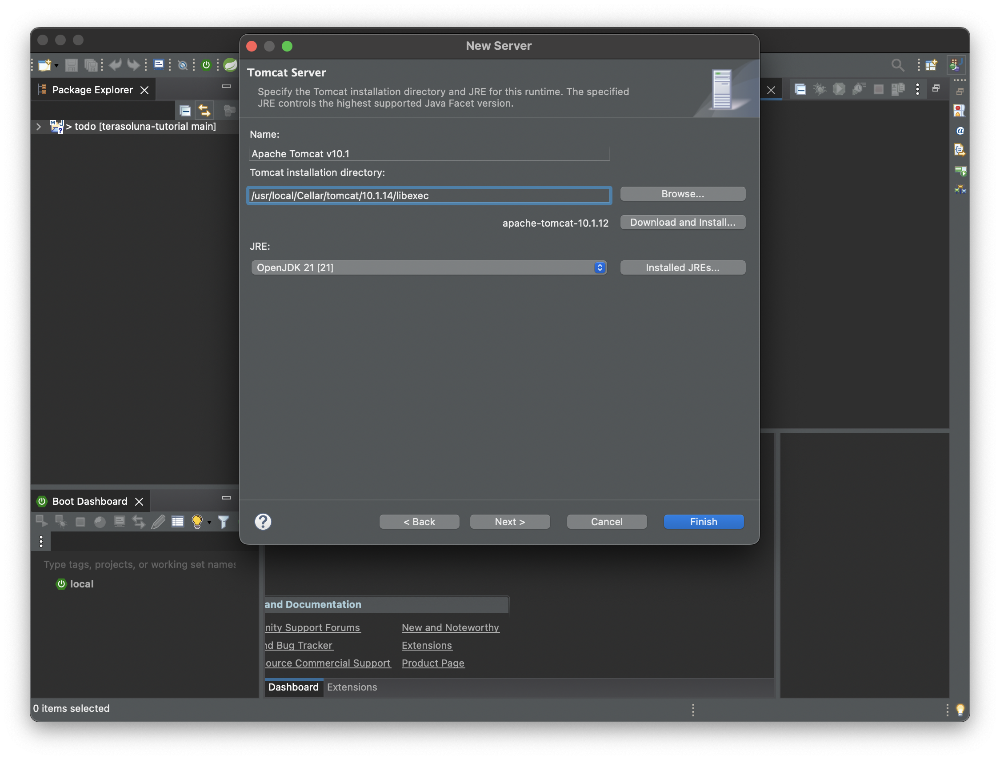

## Todoアプリの実行

プロジェクトを右クリックして「Run As」->「Run on Server」を選択する。


APサーバー(Tomcat v10.1 Server at localhost)を選択し、「Next」をクリックする。

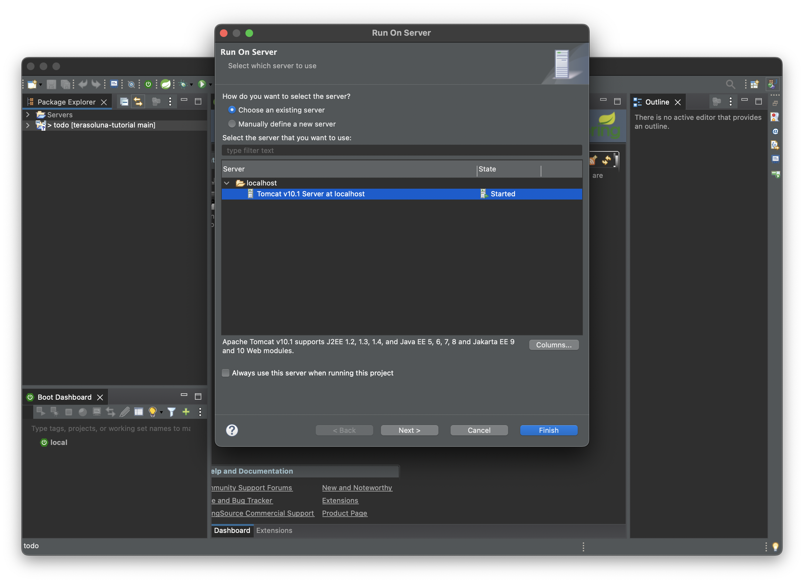

ブラウザが起動して `Hello world!` と表示される。

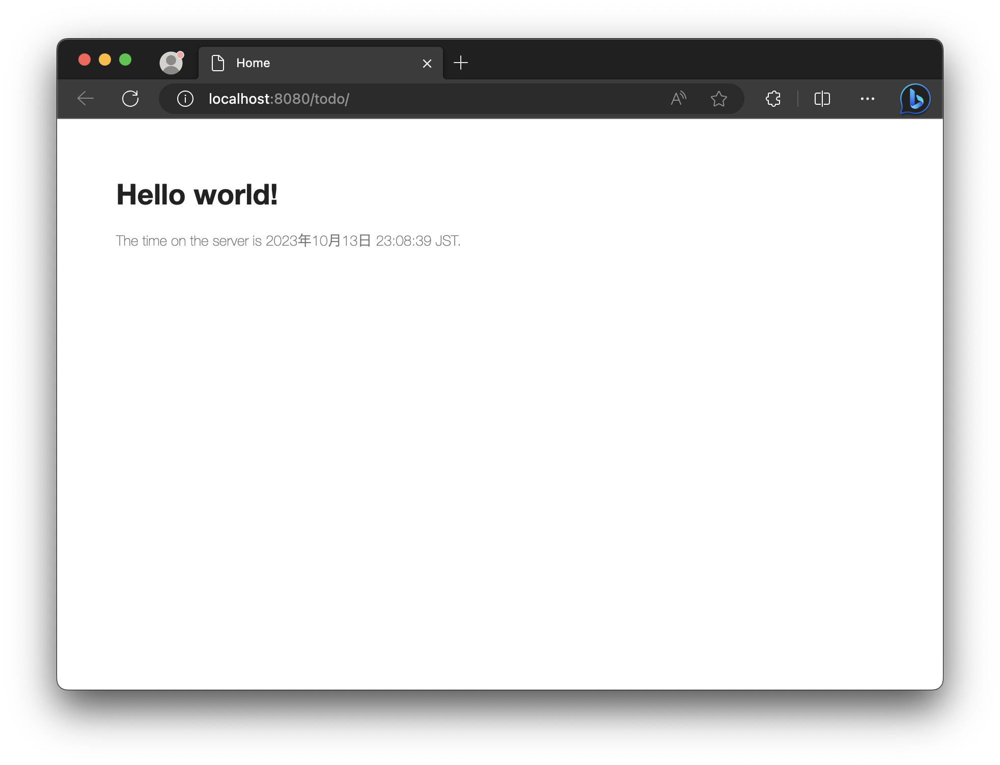

コンソールを見ると、

- 共通ライブラリから提供している`TraceLoggingInterceptor`のTRACEログ
- Controllerで実装したINFOログ

が出力されていることがわかる。

```
date:2023-10-14 08:39:22	thread:http-nio-8080-exec-5	X-Track:5fff1c4c34e24520b1e86275ad3ab2cd	level:TRACE	logger:o.s.w.s.m.m.a.RequestMappingHandlerMapping      	message:Mapped to com.example.todo.app.welcome.HelloController#home(Locale, Model)
date:2023-10-14 08:39:22	thread:http-nio-8080-exec-5	X-Track:5fff1c4c34e24520b1e86275ad3ab2cd	level:TRACE	logger:o.t.gfw.web.logging.TraceLoggingInterceptor     	message:[START CONTROLLER] HelloController.home(Locale,Model)
date:2023-10-14 08:39:22	thread:http-nio-8080-exec-5	X-Track:5fff1c4c34e24520b1e86275ad3ab2cd	level:INFO 	logger:com.example.todo.app.welcome.HelloController    	message:Welcome home! The client locale is ja.
date:2023-10-14 08:39:22	thread:http-nio-8080-exec-5	X-Track:5fff1c4c34e24520b1e86275ad3ab2cd	level:TRACE	logger:o.t.gfw.web.logging.TraceLoggingInterceptor     	message:[END CONTROLLER  ] HelloController.home(Locale,Model)-> view=welcome/home, model={serverTime=2023年10月14日 8:39:22 JST}
date:2023-10-14 08:39:22	thread:http-nio-8080-exec-5	X-Track:5fff1c4c34e24520b1e86275ad3ab2cd	level:TRACE	logger:o.t.gfw.web.logging.TraceLoggingInterceptor     	message:[HANDLING TIME   ] HelloController.home(Locale,Model)-> 7,416,772 ns
date:2023-10-14 08:44:30	thread:http-nio-8080-exec-8	X-Track:38603b70a4e44b84b0587c25bfb45d79	level:TRACE	logger:o.s.w.s.m.m.a.RequestMappingHandlerMapping      	message:Mapped to com.example.todo.app.welcome.HelloController#home(Locale, Model)
date:2023-10-14 08:44:30	thread:http-nio-8080-exec-8	X-Track:38603b70a4e44b84b0587c25bfb45d79	level:TRACE	logger:o.t.gfw.web.logging.TraceLoggingInterceptor     	message:[START CONTROLLER] HelloController.home(Locale,Model)
date:2023-10-14 08:44:30	thread:http-nio-8080-exec-8	X-Track:38603b70a4e44b84b0587c25bfb45d79	level:INFO 	logger:com.example.todo.app.welcome.HelloController    	message:Welcome home! The client locale is ja.
date:2023-10-14 08:44:30	thread:http-nio-8080-exec-8	X-Track:38603b70a4e44b84b0587c25bfb45d79	level:TRACE	logger:o.t.gfw.web.logging.TraceLoggingInterceptor     	message:[END CONTROLLER  ] HelloController.home(Locale,Model)-> view=welcome/home, model={serverTime=2023年10月14日 8:44:30 JST}
date:2023-10-14 08:44:30	thread:http-nio-8080-exec-8	X-Track:38603b70a4e44b84b0587c25bfb45d79	level:TRACE	logger:o.t.gfw.web.logging.TraceLoggingInterceptor     	message:[HANDLING TIME   ] HelloController.home(Locale,Model)-> 1,031,517 ns
```
