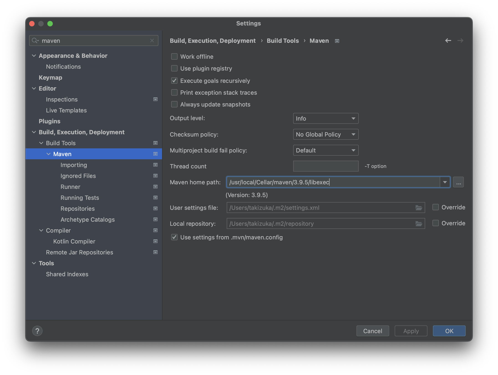
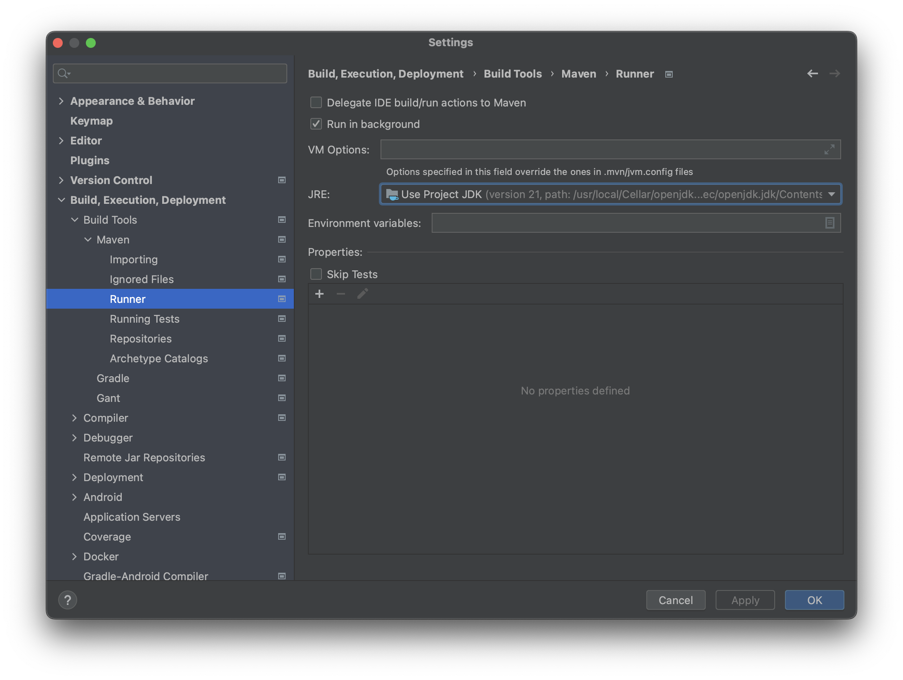
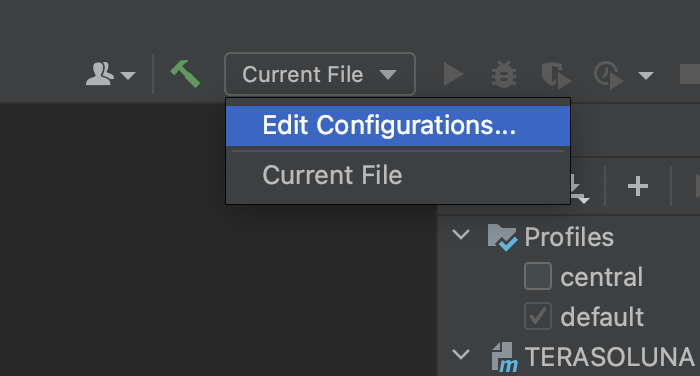
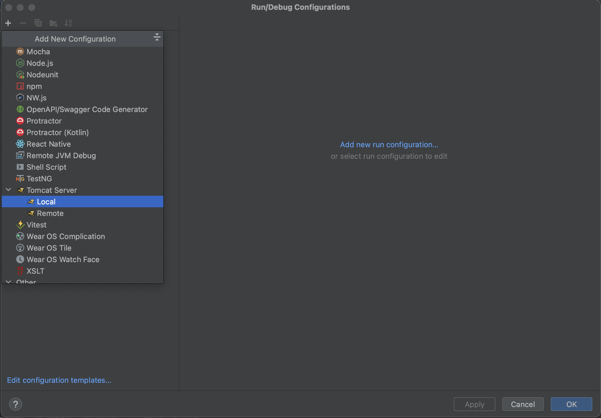
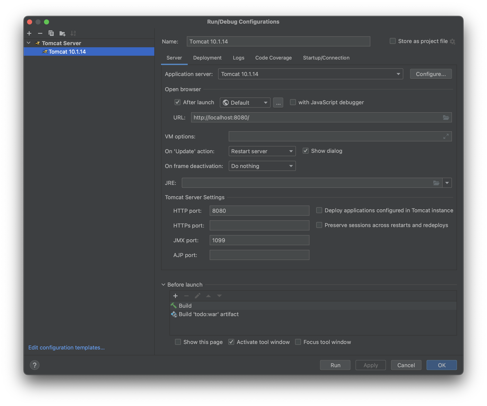
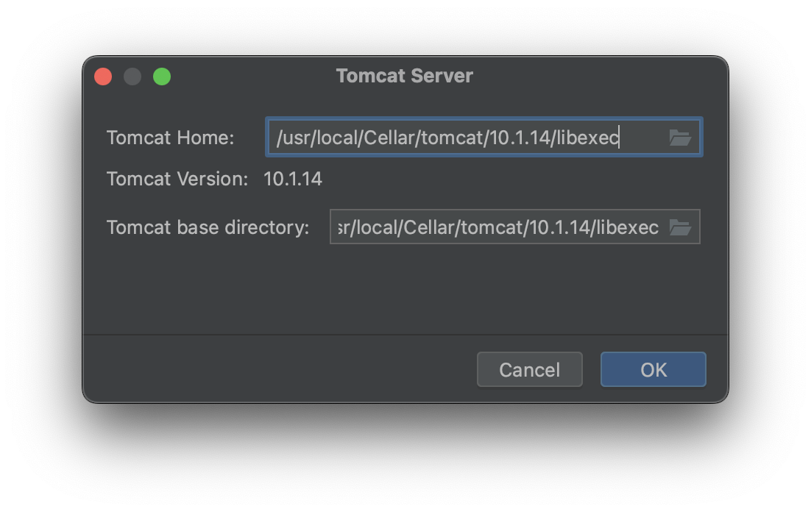
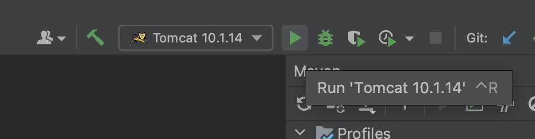

# IntelliJ IDEAの設定

## Maven設定

`Maven home path` にインストールしたMavenのパスを設定。

## JRE設定

`JRE` にインストールしたJavaのパスを設定。

## Server設定

`Edit Configurations...` から `Tomcat Server` を追加。

- `Application server:` にインストールしたTomcatを設定。
- `URL` に`http://localhost:8080/`を設定。
- `Before launch` の`Build`の次に `Build 'todo:war' artifact` を追加。

`Tomcat Home:` にインストールしたTomcatのパスを設定。

## 実行

`Run` で実行すると、ブラウザが起動してページが表示される。

